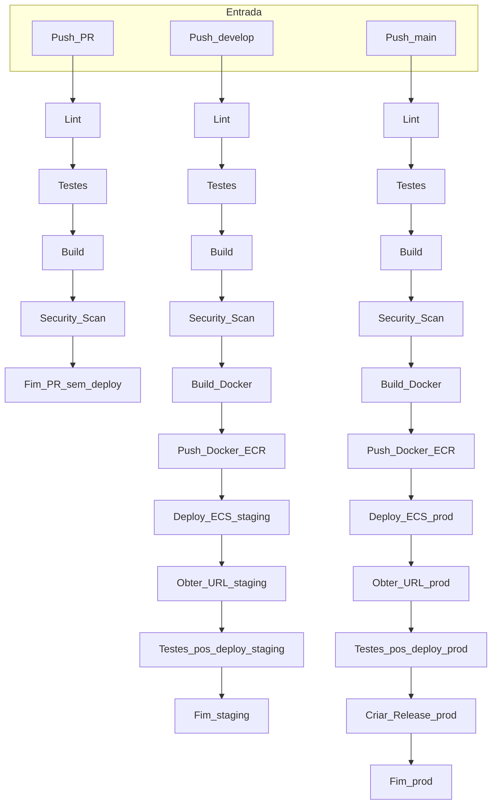

# Template CI/CD Node.js AWS ECS

Aplicação de exemplo para CI/CD moderno usando Node.js, Docker, AWS ECS Fargate e GitHub Actions.

## 🚀 Visão Geral

- API Node.js simples com rota `/status`.
- Deploy automatizado para ambientes **staging** e **produção** na AWS.
- Pipeline CI/CD robusto com validações, testes, build, scan e deploy.
- Segurança reforçada (least privilege, secrets, distroless, root FS readonly, drop capabilities).
- Rollback automatizado via workflow.
- Observabilidade: logs no CloudWatch, healthcheck, integração CloudWatch.

## 🔄 Fluxo do Pipeline CI/CD



## 🗺️ Arquitetura e Fluxo AWS


# Infraestrutura com Terraform

Este projeto possui scripts em Terraform para construir toda a infraestrutura necessária na AWS.

## Como utilizar

1. Ajuste as variáveis de acordo com seu ambiente nos arquivos:
   - `terraform/terraform.tfvars` (produção)
   - `terraform/terraform.tfvars.staging` (staging)
2. Acesse a pasta do Terraform:
   ```powershell
   cd .\terraform\
   ```
3. Execute o script de deploy:
   ```powershell
   .\deploy.ps1
   ```

O script irá aplicar a infraestrutura conforme as configurações definidas.

## 📦 Estrutura

```
├── src/                # Código da aplicação
├── tests/              # Testes automatizados
├── Dockerfile          # Build seguro (distroless)
├── .github/
│   ├── workflows/      # CI/CD e rollback
│   └── .aws/           # Task definition ECS
└── README.md           # Documentação
```

## 🛠️ Como rodar local

```bash
npm install
npm run test
npm start
```

## 🐳 Build e execução com Docker

```bash
docker build -t template-ci-cd .
docker run -p 3000:3000 template-ci-cd
```

## 🔑 Variáveis de Ambiente e Secrets Necessários

### GitHub Secrets

- `AWS_ACCESS_KEY_ID`: Chave de acesso AWS IAM
- `AWS_SECRET_ACCESS_KEY`: Chave secreta AWS IAM

### GitHub Actions Vars

- `AWS_ACCOUNT_ID`: 038462749081
- `AWS_REGION`: us-east-1
- `ECS_CLUSTER_NAME`: template-ci-cd-cluster-prod
- `ECS_SECURITY_GROUPS`: sg-03e4ec7b925fb9e59
- `ECS_SERVICE_NAME_PREFIX`: template-ci-cd-service-prod
- `ECS_SUBNETS`: subnet-049a6c7f1e04c6b05,subnet-0cbfede9311

> Configure esses valores em Settings > Secrets and variables > Actions no repositório do GitHub.

## ☁️ Deploy na AWS (ECS Fargate)

- Pipeline GitHub Actions faz build, push e deploy automático.
- Task definition: `.github/.aws/task-definition.json`
- Secrets e variáveis: GitHub Secrets e AWS Secrets Manager.

## 🔄 Rollback

- Use o workflow `rollback.yml` no GitHub Actions.
- Informe a tag da imagem Docker desejada para reverter o serviço ECS.

## 🔒 Segurança

- Usuário não-root, root filesystem readonly, drop capabilities.
- Políticas IAM mínimas para tasks.
- Secrets nunca hardcoded.
- HTTPS via API Gateway/ALB.

## 📈 Observabilidade

- Logs enviados ao CloudWatch.
- Healthcheck configurado no ECS.

## 📝 Checklist rápido

- [x] Deploy funcional (staging/prod)
- [x] Docker + GitHub Actions + AWS
- [x] Pipeline CI/CD completo
- [x] Segurança aplicada
- [x] Observabilidade
- [x] Rollback documentado
- [x] Documentação clara

## 🧯 Rollback manual

- Via workflow `rollback.yml` ou alterando tag da imagem no ECS.

---
