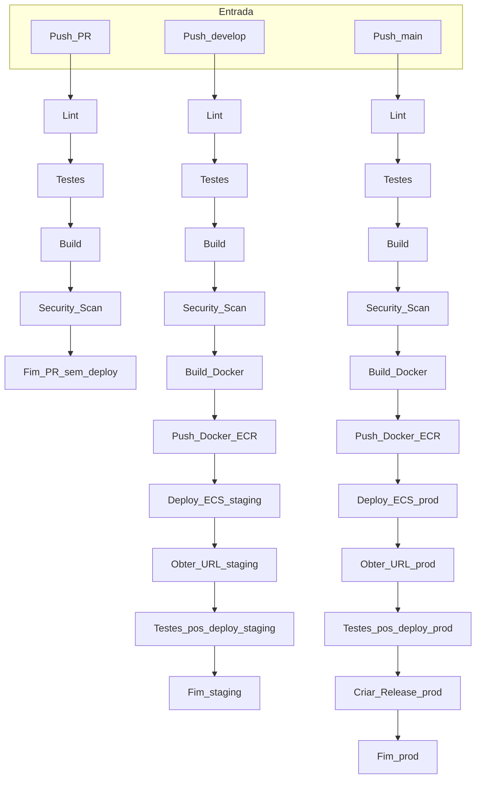
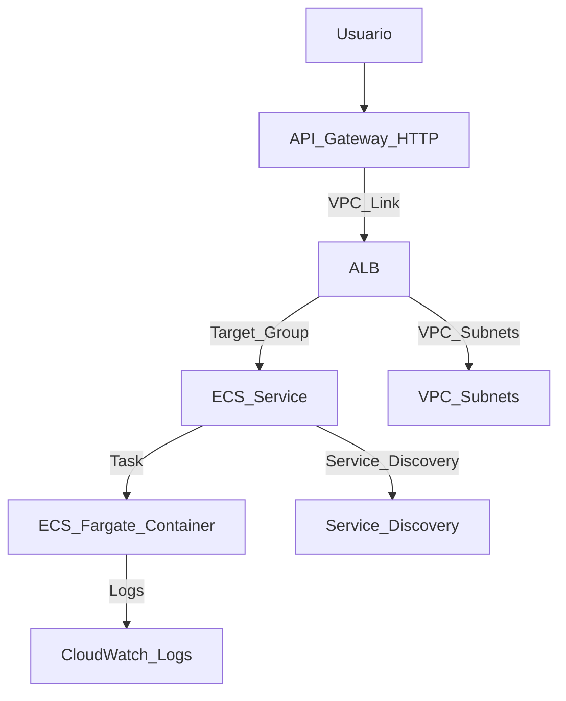

# Template CI/CD Node.js AWS ECS

Aplicação de exemplo para CI/CD moderno usando Node.js, Docker, AWS ECS Fargate e GitHub Actions.

## Links de Acesso
> **Obs:** Devido à falta de domínio, os certificados para o ALB são auto-assinados.

- **Produção:** *[https://jrv-prod-alb-2098066532.us-east-1.elb.amazonaws.com/]*
- **Staging:** [https://jrv-staging-alb-815742207.us-east-1.elb.amazonaws.com/](https://jrv-staging-alb-815742207.us-east-1.elb.amazonaws.com/)

## 🚀 Visão Geral

- API Node.js simples com rota `/status`
- Deploy automatizado para ambientes **staging** e **produção** na AWS
- Pipeline CI/CD robusto com validações, testes, build, scan e deploy
- Segurança reforçada (least privilege, secrets, distroless, root FS readonly, drop capabilities)
- Rollback automatizado via workflow
- Observabilidade: logs no CloudWatch, healthcheck, integração CloudWatch

## 🔄 Fluxo do Pipeline CI/CD



## 🗺️ Arquitetura e Fluxo AWS




## 🏗️ Infraestrutura com Terraform

Este projeto possui scripts em Terraform para construir toda a infraestrutura necessária na AWS.

### Variáveis

**Workspace Shared:** não é necessária nenhuma variável.

# Exemplo de Variaveis

```
	project_name = "template-ci-cd"
	environment = "staging"
	aws_region = "us-east-1"
	alarm_email = "contato@renatovicente.dev"
	vpc_cidr = "10.1.0.0/16"
	container_image = "038462749081.dkr.ecr.us-east-1.amazonaws.com/template-ci-cd:staging"
	container_port = 3000
	desired_count = 1
	health_check_path = "/health"
```

Workspace Shared não é necessario nenhum variavel

Staging e Prod
```
project_name = "template-ci-cd"
environment  = "staging"
aws_region   = "us-east-1"
alarm_email  = "contato@renatovicente.dev"
vpc_cidr = "10.1.0.0/16"
container_image = "038462749081.dkr.ecr.us-east-1.amazonaws.com/template-ci-cd:staging"
container_port  = 3000
desired_count = 1
health_check_path = "/health"
```
## Como utilizar usando powershell

1. Ajuste as variáveis de acordo com seu ambiente nos arquivos:
   - `terraform/terraform.tfvars` (produção)
   - `terraform/terraform.tfvars.staging` (staging)
2. Acesse a pasta do Terraform:
   ```powershell
   cd .\terraform\
   ```
3. Execute o script de deploy:
   ```powershell
   .\deploy.ps1
   ```


4. Digite o workspace **shared** - ele deve ser o primeiro ao fazer deploy, pois contém recursos compartilhados entre ambientes. 
> **Importante:** No mundo real isso não é ideal. É fortemente recomendado o uso de contas diferentes para cada ambiente!

## Deploy Manual da Infraestrutura

### Subindo o ambiente Shared


# Deploy da manual da infraestrutura

## Subindo o ambiente de Shared

```
terraform init
terraform workspace new staging
terraform workspace select staging
terraform state list
terraform plan -var-file="terraform.tfvars.staging"
# [confirmação do usuário]
terraform apply -var-file="terraform.tfvars.staging"
terraform output
```

## Subindo Staging

```
terraform init
terraform workspace new staging
terraform workspace select staging
terraform state list
terraform plan -var-file="terraform.tfvars.staging"
# [confirmação do usuário]
terraform apply -var-file="terraform.tfvars.staging"
terraform output
```

## Subindo ambiente de Prod

```
terraform init
terraform workspace select default
terraform state list
terraform plan -var-file="terraform.tfvars"
# [confirmação do usuário]
terraform apply -var-file="terraform.tfvars"
terraform output
```

## Destruindo recursos

```
terraform init
terraform workspace select $workspace
terraform destroy -var-file="$varFile" -auto-approve
```


> **Obs:** Considere utilizar o CloudShell como boa prática!

O script irá aplicar a infraestrutura conforme as configurações definidas. Note que os recursos criados seguem o padrão de nomenclatura: `<NOME-DA-ORGANIZAÇÃO>-<AMBIENTE>-<NOME-DO-RECURSO>`, exemplo: `jrv-prod-cluster`

## 📦 Estrutura do Projeto

```
├── src/                # Código da aplicação
├── tests/              # Testes automatizados
├── Dockerfile          # Build seguro (distroless)
├── .github/
│   ├── workflows/      # CI/CD e rollback
│   └── .aws/           # Task definition ECS
└── README.md           # Documentação
```

## 🛠️ Como rodar local

```bash
npm install
npm run test
npm start
```

## 🐳 Build e execução com Docker

```bash
docker build -t template-ci-cd .
docker run -p 3000:3000 template-ci-cd
```


## 🔑 Variáveis de Ambiente e Secrets Necessários

Devem ser criados dois ambientes: staging e prod, com as seguintes variáveis dos respectivos ambientes:

### GitHub Secrets
- `AWS_ACCOUNT_ID`: ID da conta AWS
- `AWS_ROLE_NAME`: Role do github-actions

### GitHub Actions Variables
- `API_URL`: Link da API para smoke test
- `AWS_REGION`: us-east-1
- `ECR_NAMESPACE`: `<ORGANIZAÇÃO>-<AMBIENTE>-ecr`
- `ECS_CLUSTER_NAME`: `<ORGANIZAÇÃO>-<AMBIENTE>-cluster`
- `ECS_SERVICE_NAME_PREFIX`: `<ORGANIZAÇÃO>-<AMBIENTE>-service`
- `ORG_NAME`: `<NOME-DA-ORGANIZAÇÃO>`

> Configure esses valores em **Settings > Secrets and variables > Actions** no repositório do GitHub.

## ☁️ Deploy na AWS (ECS Fargate)

- Pipeline GitHub Actions faz build, push e deploy automático
- Task definition: `.github/.aws/task-definition.json`
- Secrets e variáveis: GitHub Secrets e AWS Secrets Manager

## 🔄 Rollback

- Use o workflow `rollback.yml` no GitHub Actions
- Informe a tag da imagem Docker desejada para reverter o serviço ECS

## 🔒 Segurança

- Usuário não-root, root filesystem readonly, drop capabilities
- Políticas IAM mínimas para tasks
- Secrets nunca hardcoded
- Certificado ACM auto-assinado para exemplificação via API Gateway/ALB

## 📈 Observabilidade

- Logs enviados ao CloudWatch
- Healthcheck configurado no ECS
- 2 alertas configurados com envio de e-mail via SNS

> **Nota:** Existem as rotas `/latency` e `/error` que simulam esses alertas para testes.

---